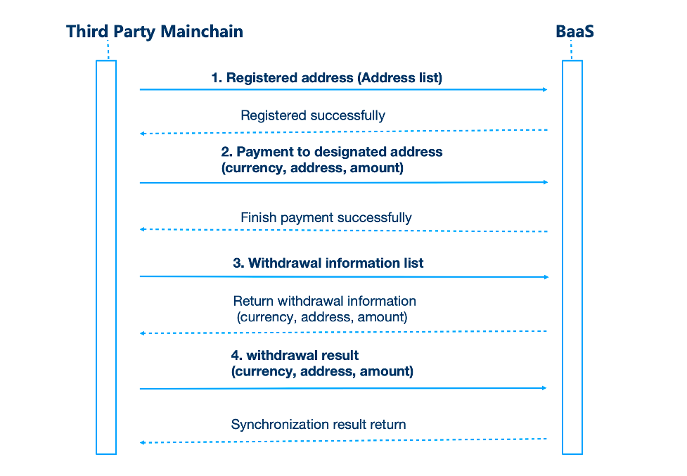

3.Docking Solutions
====================

In order to allow public chain developers to access the WaaS alliance more conveniently and quickly, we provide BaaS services to meet the public chain docking needs. Based on the docking experience of past customers, the platform has sorted out a set of docking solutions. details as follows:

The whole Process is divided into three steps：

3.1 Register A Deposit Address

3.2 Make Deposits

3.3 Make Withdrawals

The overall docking process is as follows
-------------------

3.1 Register A Deposit Address
-------------------

1）The number of available addresses can be queried by currency name. 
Note: (When pushing addresses, there is a limit on the number of addresses that cannot exceed 100 at a time, and the total number of available addresses cannot exceed 5000. Interface address: /api/v1/address/available)

2）Push the currency name and address list to the BaaS platform, after the response is successful, and the representative registered address is successful (interface address: /api/v1/address/register) 
Note: If the type of registered currency is memo, the same address Only one registration is allowed.。

3.2 Make Deposits
-------------------

1）The third-party wallet detects that the address has a deposit transaction, initiates a deposit notification, and informs the BaaS system (interface address: /api/v1/deposit/notify)

2）BaaS returns the notification result

3.3 Make Withdrawals
-------------------

1）The user initiates a withdrawal request in the WaaS system
2）Main chain developers pull the list of withdrawals (interface address: /api/v1/withdraw/consume)
3）After the chain is successfully connected, BaaS will be notified of the withdrawal result, and the BaaS interface will respond (interface address: /api/v1/withdraw/notify)

Note: In case of special circumstances, the withdrawal request can be withdrawn and a notification will be pushed to the BaaS interface (interface address: /api/v1/withdraw/cancel)

