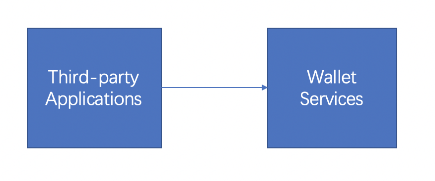

1 Preparation
====================

1.1 Development Instructions
-------------------

1）Development mode
~~~~~~~~~~~~~~~~~~~

To meet the diverse business needs of customers, ChainUp Custody supports two docking methods: SDK and API;

**SDK**：Support for Java and PHP

The Java SDK addres：https://github.com/HiCoinCom/java-sdk

The PHP SDK address：https://github.com/HiCoinCom/php-sdk

**API**：Please see the documentation

2）Two pairs of public and private key functions (API mode）
~~~~~~~~~~~~~~~~~~~~~~~~~~

**The first pair of public and private keys**： The developer shall generate a pair of public and private keys in advance when opening the asset management account. The public key (rsa_third_pub) is provided to the platform and the private key is kept by itself. The private key is the only proof for the third-party application to call the wallet service and shall not be disclosed to anyone. When the third party requests the wallet service, the private key is used to encrypt the request parameters. When the platform receives the request, the public key (rsa_third_pub) is used to decrypt the request data.

**The second pair of public and private keys**： After the developer opens the asset management account, the platform will provide the wallet public key (rsa_wallet_pub) to the developer. When the third-party application receives the response data or asynchronous notification of the wallet, it needs to use the public key to decrypt.

3）Why is it necessary to confirm the withdrawal twice (API method)
~~~~~~~~~~~~~~~~~~~~~~~~~~~~~~~~~~~~~~

When the wallet service receives a request from a third-party application, in confirm that the request is a legitimate request from a third-party application, it will call the interface provided by the third-party to confirm. To a certain extent, this process can avoid the influence caused by the loss of the third party's private key, and also provides an effective barrier for the security of the wallet service.

4）Domain name and API key (API mode)
~~~~~~~~~~~~~~~~~~~~~~~~~~~~~~~~~~~~~

:Production domain name(test environment not supported): https://openapi.hicoin.vip
:app_id: Please get it after creating the wallet
:rsa_wallet_pub: Custody system public key; Please create the wallet and get it from the Custody system
:rsa_third_prv: Client private key; Independent generation and preservation
:rsa_third_pub: Client public key; Autonomous generation; Please create the wallet and configure it to the Custody system

**RSA public/private key generated address**
http://www.metools.info/code/c80.html

Recommended password length：2048

Recommended key format：PKCS#8

Description：

a) Rsa_third_prv is a private key for third-party applications and is used primarily to encrypt request parameters. In a production environment, rsa_third_prv is generated by the developer and the corresponding public key is provided to the platform. To simplify the docking process for developers, a set of third-party public and private keys is directly provided here to facilitate quick docking for developers.

b) Test environment docking is not supported at present, please register to create a wallet according to ** Access Guidelines **, and get the API related information of the production environment.

1.2 Asset management account preparation
-------------------

The developer prepares the following information：

1）Generate a pair of public and private keys and provide the public key to the platform;

2）IP of third-party application server;

3）Recharge withdrawal callback notification address;

4）Reconfirm the address for withdrawal;

5）Whether to enable the automatic collection function. After the function is enabled, the system will automatically transfer the user's recharge funds to the merchant collection account.

Contact relevant personnel of the platform to provide the above five types of information. The platform prepares an asset management account for you and provides you with the following information:

1）Unique identification of the merchant：app_id；

2）The wallet public key：rsa_wallet_pub。

1.3 Interface interaction process
-------------------

Documentation is the interface that the wallet service provides to third-party applications.

The interface providers in the following documents are referred to as **wallet services**，and the interface callers are referred to as  **third-party applications**. When the third-party application requests the wallet service, it encrypts the request parameters through the RSA algorithm and decrypts the response data after receiving the wallet service

1.4 Interface rules
--------------
:Transfer mode: https(HTTP is temporarily used in the test environment)
:Signature field: All required fields, except the Sign field, need to be signed
:The response status code is: 0, indicating successful processing, and non-0 indicates request error or system exception
:Request address: domain name + interface address
:Encryption algorithm: See Appendix 1 for details
