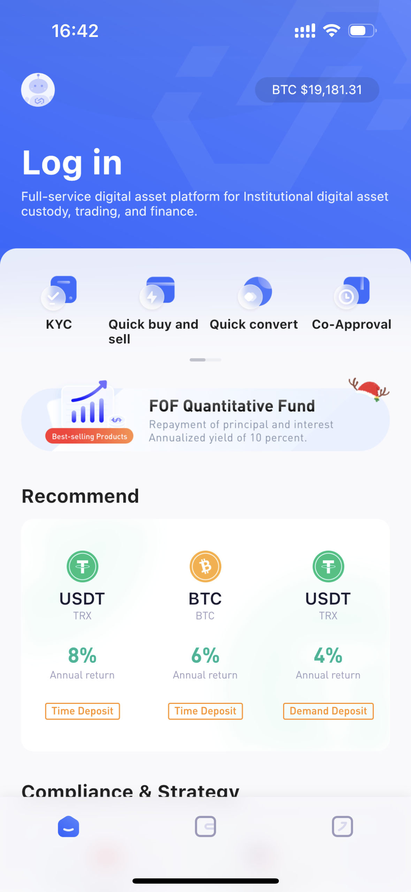
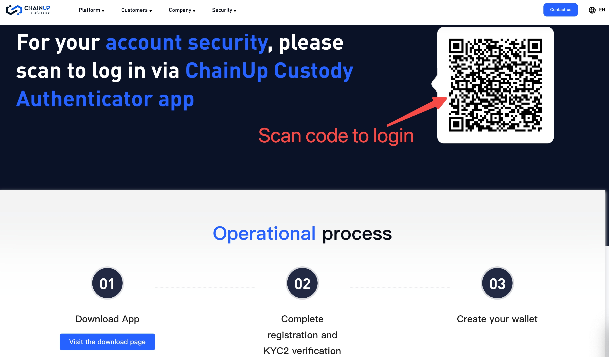

II. Access Guidelines
====================

You need to follow the following procedure to access the WAAS Alliance

.. image:: images/api_plan_jieruzhiyin2.png
   :width: 800px
   :align: center

1.Create an account
-------------------

1.1 Download the TopValue wallet
~~~~~~~~~~~~~~~~~~~

Method 1：Open the link in your mobile browser：https://www.hicoin.com/appDownload?locale=en-US

Method 2：Use WeChat to scan the code to open the link to download:

.. image:: images/QR.jpg
   :width: 200px
   :align: center

1.2 Register for TopValue account
~~~~~~~~~~~~~~~~~~~
Open the [TopValue] app and register the account (register when the unregistered account is logged in), which supports email and mobile phone number

.. image:: images/api_plan_zhucezhanghao4.png
   :width: 180px
   :align: center

1.3 Complete Person Verification
~~~~~~~~~~~~~~~~~~~
Open the user center - [Not Verified], enter the Person Verification page

.. image:: images/api_plan_shezhi3.png
   :width: 180px
   :align: center

.. image:: images/api_plan_shezhi4.png
   :width: 180px
   :align: center

Complete [Person Verification] and [Google Authentication] (Level 2 requires platform review, you can contact the project manager or customer service for quick review)

.. image:: images/api_plan_shimingrenzheng2.png
   :width: 180px
   :align: center

2.Create and configure a corporate wallet
-------------------

2.1 Log in to the WAAS platform
~~~~~~~~~~~~~~~~~~~

Open the WAAS platform (waas.chainup.com or custody.chainup.com) in the browser, scan the QR code and log in using the [TopValue] app on the home page or the [scan] function of the cloud wallet

2.2 Create a wallet
~~~~~~~~~~~~~~~~~~~

Enter the 【WAAS Alliance】 page and create the wallet (the name of the wallet does not support modification, please fill in carefully).

2.2 Open currency
~~~~~~~~~~~~~~~~~~~

Before opening the currency, please contact the platform to open the main chain currency first (after opening the main chain currency, the corresponding token can be used for free, if not included, you can contact the platform to offer the currency for free)

After opening currency, enter the wallet and click "Currency Management" to search for currency

.. image:: images/api_plan_bizhongguanli.png
   :width: 800px
   :align: center

Go to the edit page and open the currency

2.3 Obtain API information
~~~~~~~~~~~~~~~~~~~

Create APIs (currently only one full permissions API is supported)

.. image:: images/api_plan_apiliebiao.png
   :width: 800px
   :align: center

The creation is complete and the public key information is perfected

2.4 Development and testing
~~~~~~~~~~~~~~~~~~~

Systematically docking with API documents according to the technical solutions provided by the platform

3.Merchant signing
-------------------

3.1 Formal signing
~~~~~~~~~~~~~~~~~~~

Support online and offline signing

3.2 Payment expenses
~~~~~~~~~~~~~~~~~~~

Payment of system subscription, installation and other costs (the specific types of fees shall be subject to the contract)

4.Put it to use
-------------------

4.1 Assist on-line
~~~~~~~~~~~~~~~~~~~

Assist merchants to officially launch operations

4.2 Technical support
~~~~~~~~~~~~~~~~~~~

The platform provides 7* 24H technical support
