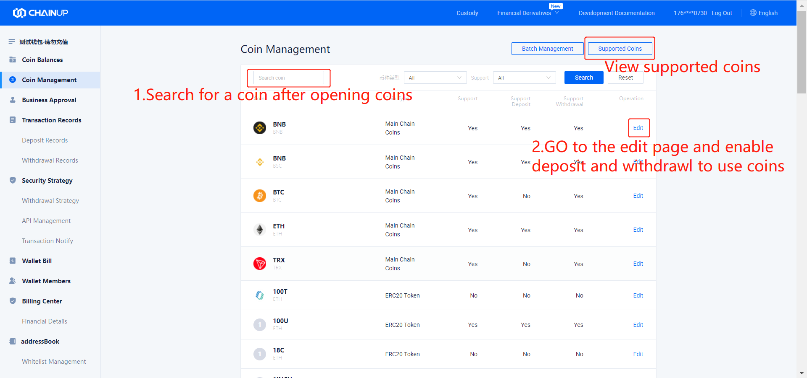

II. Access Guide
====================

Follow the instructions below to access ChainUP Custody 

.. image:: images/api_plan_jieruzhiyin2.png
   :width: 800px
   :align: center

1.Create an account
-------------------

1.1 Download TopValue wallet
~~~~~~~~~~~~~~~~~~~

Method 1：Open the link in your mobile browser：https://custody.chainup.com/appDownload/

Method 2：Use WeChat to scan the QR code for download:

1.2 Register a TopValue Account
~~~~~~~~~~~~~~~~~~~
Open the app and register a new account using email and mobile phone number.

.. image:: images/api_plan_zhucezhanghao3.png
   :width: 180px
   :align: center

.. image:: images/api_plan_zhucezhanghao4.png
   :width: 180px
   :align: center

1.3 Complete Verification
~~~~~~~~~~~~~~~~~~~
Open the user center - [Not Verified], enter the Person Verification page

.. image:: images/api_plan_shezhi4.png
   :width: 180px
   :align: center

Complete personal verification and google authentication. (For security level 2, please kindly contact customer support for verification)

2.Create and configure a corporate wallet
-------------------

2.1 Login to the ChainUP Custody platform
~~~~~~~~~~~~~~~~~~~

Open ChainUP Custody platform (waas.chainup.com or custody.chainup.com) using any browser, scan the QR code,and log in using the [TopValue] app or by scanning the QR code.

.. image:: images/api_plan_saomadenglu.png
   :width: 800px
   :align: center

2.2 Create a wallet
~~~~~~~~~~~~~~~~~~~

Enter the 【ChainUP Custody】 page and create a wallet. Please fill in the name carefully because you are unable to change the name once the wallet has been created.

.. image:: images/api_plan_chuangjianqianbao1.png
   :width: 800px
   :align: center

2.3 Add Currency
~~~~~~~~~~~~~~~~~~~

Before adding a currency, please contact the platform admin to add the main chain first. The corresponding token can only be used for free once the main chain currency has been added by the platform admin.

After adding the currency, enter the wallet and click “Currency Management” to search for the currency.

Go to the edit page and add the currency.  

.. image:: images/api_plan_bizhongbianji.png
   :width: 800px
   :align: center

2.4 Obtain API information
~~~~~~~~~~~~~~~~~~~

Create APIs (Currently only allows permission and support one set of API)  

The API creation is completed and the public key information is available now.

.. image:: images/api_plan_apixiangqing.png
   :width: 800px
   :align: center

2.5 Development and Testing
~~~~~~~~~~~~~~~~~~~

API documentation integration with the system based on the platform’s capabilities and solutions.

3.Merchant signing
-------------------

3.1 Formal signing
~~~~~~~~~~~~~~~~~~~

Support online and offline signing

3.2 Payment
~~~~~~~~~~~~~~~~~~~

Subscription payment for system, installation, and other costs. (Specific types of fees are subjected based on client’s contract)

4.Usage
-------------------

4.1 Online Assistance
~~~~~~~~~~~~~~~~~~~

Assist merchants with operations

4.2 Technical support
~~~~~~~~~~~~~~~~~~~

The platform provides 7* 24H technical support
