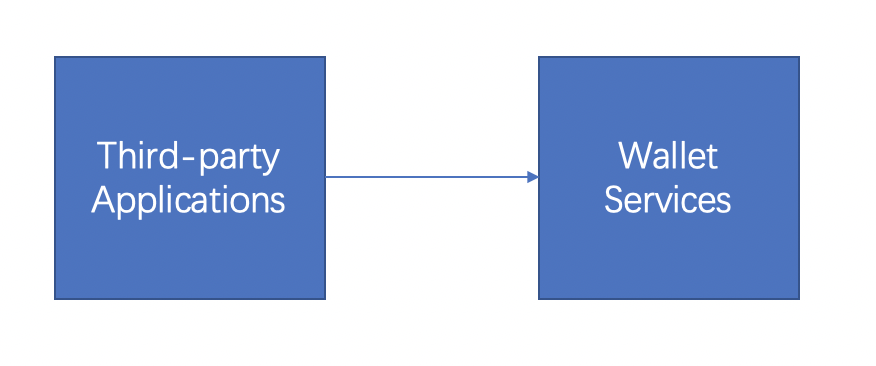

1 Interface Description
========================

1.1 Introduction
-------------------

The document is the interface provided by the wallet service to third-party applications.

The interface providers are called wallet services and the interface callers are called third-party applications in the following documents.

1.2 Interface Rules
---------------------------------

:Transfer Protocol: HTTPS is recommended for production environments, but HTTP protocols are required for test environments
:Signature Rules: in addition to the 'sign' parameter, other request parameters must be signed
:Response Status Code: 0 means success, non-zero means request error or system exception
:Signature Algorithm: please refer to Appendix
